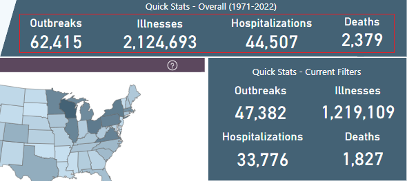

# Background

As the data scientist, you have been asked to create a report on food-borne illness outbreaks related to Norovirus and Escherichia coli (E. coli). You are given the dataset in Excel format, NORS_20241106.xlsx (Available on Blackboard),

This project uses data from the National Outbreak Reporting System (NORS). NORS is a web-based platform designed to support reporting to the US Centers for Disease Control and Prevention by local, state, and territorial health departments in the United States of all waterborne disease outbreaks and enteric disease outbreaks transmitted by food, contact with environmental sources, infected persons or animals, or unknown modes of transmission. A dashboard is available from the CDC at <https://www.cdc.gov/ncezid/dfwed/beam-dashboard.html> and the data was downloaded from <https://data.cdc.gov/Foodborne-Waterborne-and-Related-Diseases/NORS/5xkq-dg7x/about_data> on November 6, 2024.

If you do not like food-borne diseases (come on! No one wants to get sick from a delicious cookie!), you can pretend the data are on anything. This application applies to any situation where you are asked to explore a dataset with quantitative measurements on three different types of items. In this specific case, it is enteric illnesses.

# Loads all necessary libraries and init global variables

```{r}
# Load the libraries
library(dplyr)         # Work with data frames
library(lubridate)     # Work with date & time
library(stringr)       # Work with strings
library(ggplot2)       # Plot graphs
library(ggwordcloud)   # Plot word cloud
library(plotly)        # Plot choropleth maps
library(tidyr)         # Work with data
library(readxl)        # Read excel files

# Create colors
z_300 <- "#d4d4d8"
z_500 <- "#71717a"
r_100 <- "#fee2e2"
r_500 <- "#ef4444"
r_700 <- "#b91c1c"
r_900 <- "#7f1d1d"
b_100 <- "#dbeafe"
b_500 <- "#3b82f6"
b_700 <- "#1d4ed8"
b_900 <- "#1e3a8a"
```

# Reads the data

```{r}
# Read the data, the data file must be in the same folder with the source file
df <- read_excel('NORS_20241106.xlsx', sheet = 'NORS_20241106')
```

# Describes the data

## Views a glimpse of data

```{r}
# Use glimpse() to view the structure of the data
glimpse(df)
```

## Views data summary

```{r}
# View data summary
summary(df)
```

## Views data dimension

```{r}
# View data dimension
dim(df)
```

There are 62415 rows and 19 columns.

## Views the column names

```{r}
# View the column names
colnames(df)
```

Remove white spaces in column names by renaming them:

```{r}
df <- df %>%
  rename(
    "Primary_Mode"                 = `Primary Mode`,
    "Serotype_Or_Genotype"         = `Serotype or Genotype`,
    "Etiology_Status"              = `Etiology Status`,
    "Info_On_Hospitalizations"     = `Info On Hospitalizations`,
    "Info_On_Deaths"               = `Info On Deaths`,
    "Food_Vehicle"                 = `Food Vehicle`,
    "Food_Contaminated_Ingredient" = `Food Contaminated Ingredient`,
    "IFSAC_Category"               = `IFSAC Category`,
    "Water_Exposure"               = `Water Exposure`,
    "Water_Type"                   = `Water Type`,
    "Animal_Type"                  = `Animal Type`
  )
```

## View the top 10 rows

```{r}
# View the first 10 rows
head(df, n = 10)
```

## View the last 10 rows

```{r}
# View the last 10 rows
tail(df, n = 10)
```

# Explores and cleans the data

## Checks for NAs or blanks.

```{r}
# Count the number of rows in the data frame that contain NA values
paste0(nrow(df[!complete.cases(df), ]), "/", nrow(df))
```

The result shows that all rows have at least one column containing NA.

## Do you need to take appropriate action to address the missing values? Explain why you believe the NAs should be there

Based on the FAQ on the website, here are some reasons that NAs exist in the dataset:

> -   NORS collects information only on disease outbreaks of enteric illness, except for some non-enteric illness outbreaks spread through contaminated food or water.
> -   NORS does not collect information on disease outbreaks that result from an exposure in a non-U.S. location.
> -   Health departments might not report all foodborne, waterborne, or enteric disease outbreaks to NORS.
>     -   Some outbreaks are never identified.
>     -   Some outbreaks are not investigated.
>     -   Some outbreak investigations cannot be completed.
> -   The NORS View contains only information reported to NORS that CDC has reviewed.

Check for NAs or blanks, or both NAs and blanks in each column:

```{r}
# For each column
for (column_name in colnames(df))
{
  # Get column data
  # Ref: https://www.geeksforgeeks.org/difference-between-single-and-double-square-brackets-in-r/
  column_data <- df[[column_name]]
  has_NAs <- any(is.na(column_data))
  has_blanks <- any(column_data == "", na.rm = TRUE)
  
  # If the data contains NAs and blanks
  if (any(has_NAs) & any(has_blanks))
  {
    cat("Column", column_name,"has NAs and blanks as missing values\n")
  }

  # If the data contains only blanks
  if (any(has_blanks))
  {
    cat("Column", column_name, "has only blanks as missing values\n")
  }

  # If the data contains only NAs
  if (any(has_NAs))
  {
    cat("Column", column_name, "has only NAs as missing values\n")
  }
}
```

There are also some columns have data depend on a value from other columns. For examples, Food Vehicle data is only for foodborne outbreaks only. Besides, removing rows having NAs or blanks in this dataset will also reduce the overall statistic



Image was obtained from: <https://www.cdc.gov/ncezid/dfwed/beam-dashboard.html> (NORS view dashboard)

In conclusion, NAs and blanks can be kept in the dataset.

## Create a new column called Date to combine year and month

```{r}
# Create a new column Date to combine year and month as Datetime datatype
df$Date <- lubridate::ymd(paste(df$Year, df$Month, "01", sep = "-"))
```

Check column data type:

```{r}
# Check data type of Date column
class(df$Date)
```

## Select all the rows which have *Norovirus* as substring

```{r}
# Filter rows contain Norovirus as substring
norovirus_df <- df %>%
  filter(str_detect(df$Etiology, "Norovirus"))
```

## Present statistics on *Norovirus* that you think would be of interest to your project’s sponsor

### Which primary mode has the highest number of *Norovirus* outbreaks?

```{r}
# Group data by Primary_Mode column and count the number of occurences
norovirus_by_primary_mode <- norovirus_df %>% 
  count(Primary_Mode)

norovirus_by_primary_mode
```

Result: *Person-to-person* is the main reason of *Norovirus* outbreaks, with 21214 cases.

### Where are the top 3 places that *Norovirus* outbreaks occur most frequently when the primary mode is *Person-to-person*?

```{r}
person_to_person_by_setting <- norovirus_df %>% 
  # Select Person-to-person as the primary mode and filter out NAs from Setting column
  filter(Primary_Mode == "Person-to-person", !is.na(Setting))

norovirus_by_places <- person_to_person_by_setting %>%
  # Group data by Setting column and count the number of occurences
  count(Setting) %>%
  filter(n > 0) %>%
  arrange(desc(n))

norovirus_by_places 
```

Result: Top 3 places that easily transmit the *Norovirus* are *Child daycare/preschool*, *Hospital*, and *Long-term care/nursing home/assisted living facility*.

## Create graphs to visualize the statistics of *Norovirus*

### Which primary mode has the highest number of *Norovirus* outbreaks?

```{r fig.width=15, fig.height=3}
# Create a horizontal bar chart
ggplot(
  norovirus_by_primary_mode, 
  aes(x = n, y = Primary_Mode)
) +
  geom_bar(
    stat = "identity",
    aes(fill = ifelse(n == max(n), r_900, z_300))
  ) + 
  geom_text(
    # Display text for only the bar with highest number of occurrences
    aes(label = ifelse(n == max(n), n, "")),
    color = "white",
    hjust = 1.35,
    vjust = 0.35
  ) +
  # Enable custom fill color
  scale_fill_identity() +
  labs(
    title = "Norovirus outbreaks by primary mode",
    x = "Outbreaks"
  ) +
  # Adjust theme for a better look
  theme_classic() +
  theme(
    plot.title = element_text(face = "bold"),
    axis.title.x = element_text(),
    axis.title.y = element_blank(),
    axis.text.y = element_text(),
    axis.line.y = element_blank(),
    axis.ticks.y = element_blank()
  )
```

### Where are the top 3 places that *Norovirus* outbreaks occur most frequently when the primary mode is *Person-to-person*?

```{r fig.width=15,fig.height=9}
is_top_3_places <- function(setting) {
  return(setting %in% head(norovirus_by_places, 3)$Setting
  )
}

ggplot(
  norovirus_by_places,
  # x-axis is the number of occurrences, y-axis is sorted by descending of n
  aes(x = n, y = reorder(Setting, n))
) +
  geom_bar(
    stat = "identity",
    aes(fill = ifelse(is_top_3_places(Setting), r_900, z_300))
  ) +
  geom_text( # size in pt
    aes(label = ifelse(is_top_3_places(Setting), n, "")),
    color = "white",
    hjust = 1.35,
    vjust = 0.35
  ) +
  scale_fill_identity() +
  labs(
    title = "Top 3 locations for Norovirus outbreaks via Person-to-person transmission",
    x = "Outbreaks"
  ) +
  # Adjust theme for a better look
  theme_classic() +
  theme(
    plot.title = element_text(face = "bold"),
    axis.title.x = element_text(),
    axis.title.y = element_blank(),
    axis.text.y = element_text(),
    axis.line.y = element_blank(),
    axis.ticks.y = element_blank()
  )
```

## Select all the rows which have *Escherichia* as substring

```{r}
# Filter rows contain Escherichia as substring
escherichia_coli_df <- df %>%
  filter(str_detect(df$Etiology, "Escherichia"))
```

## Determine how to handle instances where multiple etiologies are listed

Instances with multiple etiologies can be split into multiple rows. However, this approach is only suitable for data visualization scenarios when only a few columns are selected to plot a graph. It cannot be applied to the entire dataset because some values, like the number of illnesses, hospitalizations, and deaths, cannot be split.

## Present statistics on *Escherichia* that you think would be of interest to your project’s sponsor

### Which primary mode has the highest number of *Escherichia* outbreaks?

```{r}
# Group data by Primary_Mode column and count the number of occurences
escherichia_coli_by_primary_mode <- escherichia_coli_df %>% 
  count(Primary_Mode)

escherichia_coli_by_primary_mode
```

Result: *Food* is the main reason of *Escherichia* outbreaks, with 784 cases.

### Which food vehicle is the most frequently associated with *Escherichia* outbreaks when the primary mode is *Food*?

```{r}
escherichia_coli_food_vehicles <- escherichia_coli_df %>% 
  # Select Food as the primary mode and filter out NAs from Food Vehicle column
  filter(Primary_Mode == "Food", !is.na(Food_Vehicle)) %>%
  # Split multiple food vehicles into separate rows, with delimiter is semicolon ';'
  separate_longer_delim(Food_Vehicle, delim = ";") %>%
  # Group data by Setting column and count the number of occurences
  count(Food_Vehicle) %>%
  # Sort by descending of n
  arrange(desc(n))

escherichia_coli_food_vehicles
```

Result: *ground beef, hamburger* is the most frequently associated with *Escherichia* outbreaks when the primary mode is *Food*.

## Create graphs to visualize the statistics of *Escherichia*

### Which primary mode has the highest number of *Escherichia* outbreaks?

```{r fig.width=15, fig.height=3}
# Create a horizontal bar chart
ggplot(
  escherichia_coli_by_primary_mode, 
  aes(x = n, y = Primary_Mode)
) +
  geom_bar(
    stat = "identity",
    aes(fill = ifelse(n == max(n), r_900, z_300))
  ) + 
  geom_text(
    # Display text for only the bar with highest number of occurrences
    aes(label = ifelse(n == max(n), n, "")),
    color = "white",
    hjust = 1.35,
    vjust = 0.35
  ) +
  # Enable custom fill color
  scale_fill_identity() +
  labs(
    title = "Escherichia outbreaks by primary mode",
    x = "Outbreaks"
  ) +
  # Adjust theme for a better look
  theme_classic() +
  theme(
    plot.title = element_text(face = "bold"),
    axis.title.x = element_text(),
    axis.title.y = element_blank(),
    axis.text.y = element_text(),
    axis.line.y = element_blank(),
    axis.ticks.y = element_blank()
  )
```

### Which food vehicle is the most frequently associated with *Escherichia* outbreaks when the primary mode is *Food*?

```{r fig.width=15,fig.height=10}
ggplot(
  escherichia_coli_food_vehicles, 
  aes(label = Food_Vehicle, size = n, color = n)) +
  geom_text_wordcloud() +
  scale_size_area(max_size = 30) +
  theme_minimal() +
  scale_color_gradient(low = z_500, high = r_900)
```

Notice that top 3 words are having *ground beef* as substring in the graph.

## Select at least one statistic and present a graph showing both Escherichia and Norovirus together

```{r}
split_etiology <- df %>%
  # Filter Etiology without NAs
  filter(!is.na(Etiology)) %>%
  # Split multiple Etiology into separate rows, with delimiter is semicolon ';'
  separate_longer_delim(Etiology, delim = ";")

# Rename the etiologies for grouping later
split_etiology$Etiology <- str_replace(split_etiology$Etiology, ".*Norovirus.*", "Norovirus")
split_etiology$Etiology <- str_replace(split_etiology$Etiology, ".*Escherichia.*", "Escherichia")

# Add state code column for plotting choropleth map
split_etiology$State_Code <- state.abb[match(split_etiology$State, state.name)]

# Filter Norovirus and Escherichia etiologies only
norovirus_and_escherichia <- split_etiology %>%
  filter(Etiology == "Norovirus" | Etiology == "Escherichia")
```


### The total number of sickened (illnesses, hospitalizations & deaths) of Norovirus and Escherichia etiologies by year

```{r}
norovirus_and_escherichia_by_year <- norovirus_and_escherichia %>%
  # Select Year and Etiology
  select(Year, Etiology, Illnesses, Hospitalizations, Deaths) %>%
  group_by(Year, Etiology) %>%
  summarize(
    # Calculate sum of illnesses, hospitalizations & deaths, ignoring NAs
    Total_Sickened = sum(Illnesses + Hospitalizations + Deaths, na.rm = TRUE)
  ) %>%
  filter(Total_Sickened > 0)

norovirus_and_escherichia_by_year
```


```{r fig.width=15,fig.height=5}
ggplot(
  norovirus_and_escherichia_by_year, 
  aes(x = Year, y = Total_Sickened, 
      color = Etiology,
      group = Etiology
  )
) +
  geom_line(size = 1) +
  geom_point(size = 3, aes(shape=Etiology)) +
  scale_color_manual(values = c("Norovirus" = r_700, "Escherichia" = b_700)) +
  labs(
    title = "Total number of sickened (illnesses, hospitalizations & deaths) of Norovirus and Escherichia etiologies by year",
    x = "Year",
    y = "Total number of sickened"
  ) +
  theme_classic()
```

Result: Norovirus has a higher number of sickened individuals compared to Escherichia throughout the years.

### Norovirus and Escherichia etiologies outbreaks by state

```{r}
norovirus_and_escherichia_by_state <- norovirus_and_escherichia %>%
  # Select Year and Etiology
  select(State, State_Code, Etiology, Illnesses, Hospitalizations, Deaths) %>%
  group_by(State_Code, Etiology) %>%
  summarize(
    # Calculate sum of illnesses, hospitalizations & deaths, ignoring NAs
    Total_Sickened = sum(Illnesses + Hospitalizations + Deaths, na.rm = TRUE)
  ) %>%
  filter(Total_Sickened > 0)

norovirus_and_escherichia_by_state
```

```{r}
norovirus_and_escherichia_by_state %>%
  filter(Etiology == "Norovirus") %>%
  plot_geo(locationmode = 'USA-states') %>%
  # Build the map
  add_trace(
    type="choropleth",
    z = ~Total_Sickened,
    locations = ~State_Code,
    color     = ~Total_Sickened,
    colorscale = list(
      # Low level
      c(0, "#fee2e2"),
      c(0.5, "#ef4444"),
      c(1, r_900)
    )
  ) %>%
  # https://plotly.com/r/reference/layout/geo
  layout(
    title = 'Norovirus etiologies outbreaks by state',
    geo = list(
      # Show USA instead of the world map
      scope      = "usa",
      # Map data across the states
      projection = list(type = "albers usa")
    )
  ) %>%
  # Color bar title
  colorbar(title = "Total number of sickened")
```

```{r}
norovirus_and_escherichia_by_state %>%
  filter(Etiology == "Escherichia") %>%
  plot_geo(locationmode = 'USA-states') %>%
  # Build the map
  add_trace(
    type="choropleth",
    z = ~Total_Sickened,
    locations = ~State_Code,
    color     = ~Total_Sickened,
    colorscale = list(
      # Low level
      c(0, b_100),
      c(0.5, b_500),
      c(1, b_900)
    )
  ) %>%
  # https://plotly.com/r/reference/layout/geo
  layout(
    title = 'Escherichia etiologies outbreaks by state',
    geo = list(
      # Show USA instead of the world map
      scope      = "usa",
      # Map data across the states
      projection = list(type = "albers usa")
    )
  ) %>%
  # Color bar title
  colorbar(title = "Total number of sickened")
```


